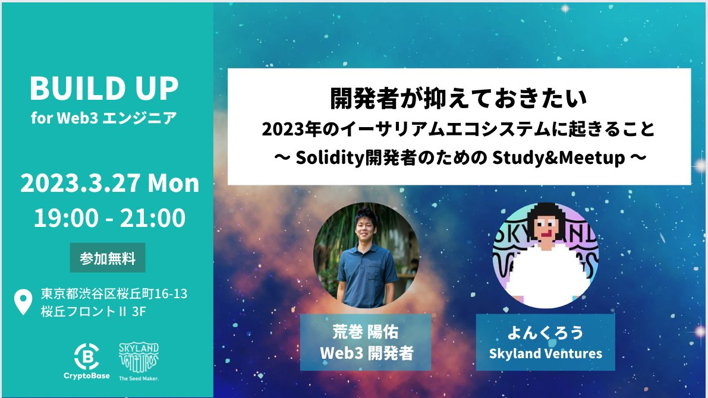
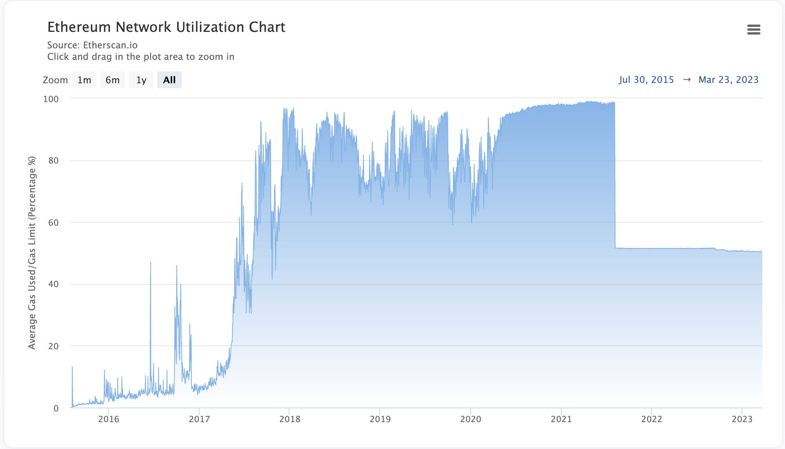
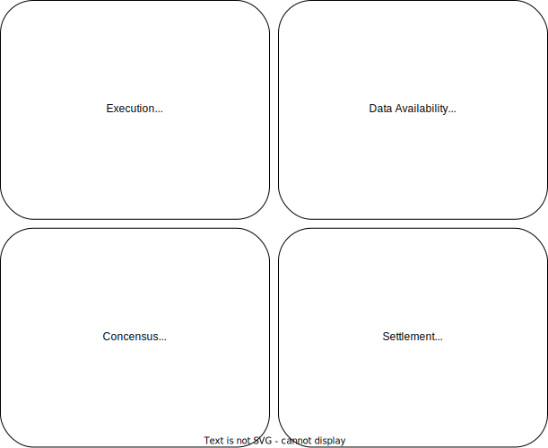
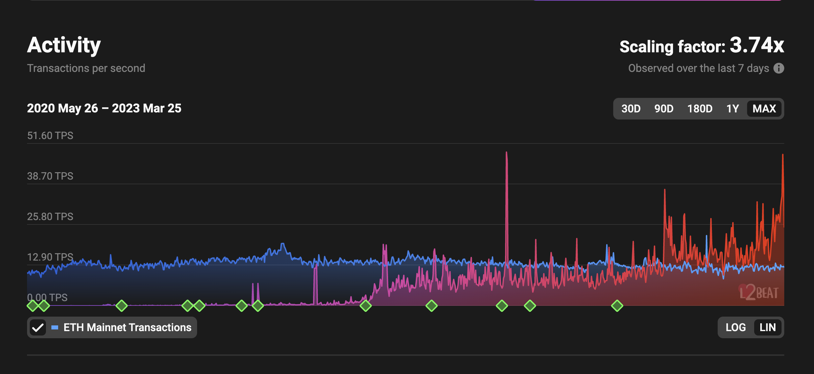
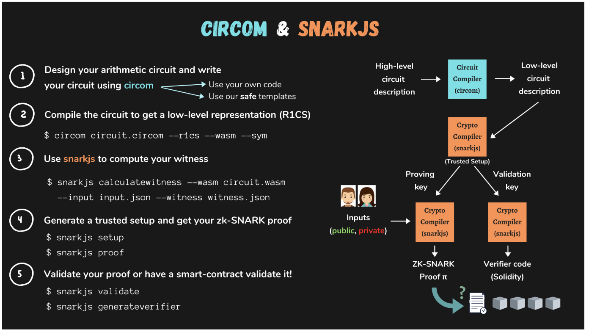

# 開発者が抑えておきたい
## 2023年イーサリアムエコシステムに起きること

BUILD UP for Web3 エンジニア
2023年3月27日

<!--
_class: lead
_paginate: false
_header: ""
_footer: ""

backgroundColor: #192043
color: #ffffff
-->

---

<!--
_paginate: false
_header: ""
_footer: ""
-->

---

# 目次
1. 開発者として押さえておくべきイーサリアムアコシステムの現状とこれから
2. ブロックチェーンをどう捉えるか
3. ETH Tokyoに向けてサービスの事例紹介

---

<!--
_class: lead
-->

# 1.　開発者として押さえておくべきイーサリアムアコシステムの現状とこれから

---

### Ethereumの課題

  

---

### Ethereumの現状

- もっぱらscalabilityに注力
- Scalabilityの一つとしてのLayer2
  - シャーディングも進んでるけど、L2がコアの開発を待たずにできる
- L2の実態はスマートコントラクト
  - ORのトランザクションをまとめてL1に書き込んでいる、その情報を元にL2のnode/sequencerを構築
    - ex) OP：[CanonicalTransactionChain (CTC)](https://etherscan.io/address/0x5E4e65926BA27467555EB562121fac00D24E9dD2)
  - ZKRの場合は[state diff](https://ethereum.org/en/developers/docs/scaling/zk-rollups/)のみを書き込んでる

---

### Ethereumの現状 : 分類

---

### Ethereumの現状 : Modular とは

---

### Ethereumの現状 : L2の現状

  

---

### Ethereum現状をどう捉えるか

- 23年はOR、それ以降はZKR
- ORにはEthrerumのアップデートに追従しやすいよさはある
  - Arbitrum : [AnyTrust](https://medium.com/offchainlabs/introducing-anytrust-chains-cheaper-faster-l2-chains-with-minimal-trust-assumptions-31def59eb8d7), [Stylus](https://offchain.medium.com/hello-stylus-6b18fecc3a22) / Optimism : [Op Stack](https://optimism.mirror.xyz/fLk5UGjZDiXFuvQh6R_HscMQuuY9ABYNF7PI76-qJYs)
- StarkNetは独自路線を進んでいて長期でみると面白い。
- Polygonがどこまで伸びるか
    - [Supernets](https://wiki.polygon.technology/docs/supernets/get-started/what-are-supernets/) / [Avail](https://www.alchemy.com/dapps/polygon-avail) / Nightfall/[Miden](https://wiki.polygon.technology/docs/miden/intro/main/)
    - [LX-LY bridge](https://wiki.polygon.technology/docs/category/zkevm-bridge)
- L3が増えるかmodular chainが台頭するかは要観察
  - Optimism op stack / Arbitrum AnyTrust / Polygon Avail / zkSync zkPorter / StarkNet starkWare

---

### Ethereumの今後 : ロードマップ

  

---

### Ethereumの今後 : アップデート

  - [Shanghai](https://github.com/ethereum/execution-specs/blob/master/network-upgrades/mainnet-upgrades/shanghai.md)
    - ETHの引き出しが可能
    - [Selfdestructの廃止](https://hackmd.io/@vbuterin/selfdestruct)
  - [Cancun](https://github.com/ethereum/execution-specs/blob/master/network-upgrades/mainnet-upgrades/cancun.md)
    - [EIP-4844: Shard Blob Transactions](https://github.com/ethereum/execution-specs/blob/master/network-upgrades/mainnet-upgrades/cancun.md)
    - [EOF](https://notes.ethereum.org/@ipsilon/eof1-unified-specification)

---

### Ethereumの今後をどう捉えるか

- Ethereumはよりセキュリティーを担うレイヤーになる
  - Polkadotの[Relay Chainによるshared security](https://wiki.polkadot.network/docs/learn-parachains)やCosmosHubの[Interchain security](https://blog.cosmos.network/interchain-security-is-coming-to-the-cosmos-hub-f144c45fb035), [mesh security](https://medium.com/@MultichainMedia/mesh-security-is-coming-to-cosmos-74c401da28ff)に比べると、Ethereumはスマートコントラクトに記載する（将来的にはBlob or shard）のみで、セキュリティー提供に柔軟性がない
- L2の足並みが揃ってないので、Ethereum全体としての成長が鈍化しそう
- 開発者へのアップデートが少ない
- ただ、まず今求められている最低限のものを実装している、ゆえにシンプルで複雑なものを上に作りやすい
  - Ethereum界隈の開発スピードはかなり早いしまだ中心になっている

---

### Ethereumの今後をどう捉えるか

- "it's okay if no single person can understand the whole protocol, because we can specialize"
- "We don't know exactly what the needs of 2032 will demand"
  - by vitalik

---

<!--
_class: lead
_paginate: false
_header: ""
_footer: ""

backgroundColor: #192043
color: #ffffff
-->

# 2. ブロックチェーンをどう捉えるか

---

### 開発者としてブロックチェーンをどう捉えるか

- Web2 : 情報革命 → 完成系としてのAI
- Web3 : 価値革命 →　??
  - **ブロックチェーンではそれ以外の分野（何かしらの価値がつくもの）も大きく変える**

---

### 開発者としてブロックチェーンをどう捉えるか

- ブロックチェーン = Ethereumはstate machine ≒ DB
- スマートコントラクト = stateの書き込みと読み込みの定義 ≒ API
  - お金を払えば誰でも書き込みができる、読み込みはタダでできる
  - その書き込まれたデータは恣意的に変更できない（セキュリティー）

#### 価値がつかなかったものに価値をつける
#### 流動性の低かった（市場に出てなかった）資産の流動性を向上させる

---

<!--
_class: lead
-->

## 3. ETH Tokyoに向けてサービスの事例紹介

---

# ETH Tokyoに向けてサービスの事例紹介

- スマートコントラクトのアプリケーションは大きく分けると２つがメイン
  - EIP（特にERC20とERC721）によって生まれたアプリ
    - ERC20は保有量を管理したテーブル → DeFi
    - ERC721は保有者を管理したテーブル → NFT
  - コントラクトウォレット

---

### ERC20 / ERC721の拡張

- EIPの規格にさえ準拠=関数名と引数さえあっていれば、関数のロジックはなんでもいい
- ERC20の例
  - [AAVEのaToken](https://github.com/aave/protocol-v2/blob/1.0/contracts/protocol/tokenization/AToken.sol#L177-L189) : 利子分を追加して残高を返却
  - [Compoundのcomp](https://github.com/compound-finance/compound-protocol/blob/master/contracts/Governance/Comp.sol#L233-L260) : tokenの移転と同時にdelegateも移転
  - Ampleforth : MoneySupplyの増減で価格を維持
    - [balanceOf](https://github.com/ampleforth/ampleforth-contracts/blob/master/contracts/UFragments.sol#L166-L172) / [rebase](https://github.com/ampleforth/ampleforth-contracts/blob/master/contracts/UFragments.sol#L108-L143)
- ERC721
  - [Uniswap V3 LP](https://github.com/Uniswap/v3-periphery/blob/main/contracts/libraries/NFTSVG.sol#L46-L74) : SVGとparamでNFTを型から生成

---

#### ERC20 / ERC721の拡張 : まとめ
- EIPはInterfaceの定義のみなので、それさえ守ればその先の可能性は無限大
- 規格を作ることができる
  - ブロックチェーンを利用したLGBTカップル調印式 by [famiee](https://www.famiee.com/top/)

---

### コントラクトウォレットとメタトランザクション
- アカウントは２つ：EOA / Contract Account = スマートコントラクトなので拡張性は様々
- Multisig : Gnosis Safe
  - コアは[execute](https://github.com/safe-global/safe-contracts/blob/main/contracts/base/Executor.sol#L21-L39)のみ。call() or delegateCall()で叩き先を指定するので、全てのtxに柔軟に対応できる
- AA : Patch wallet
  - txの実行をbundlerに移譲
- メタトランザクション : txの署名と実行の分離
  - [EIP2612(permit)](https://github.com/centrehq/centre-tokens/blob/master/contracts/v2/EIP2612.sol#L61-L86) / [EIP3009](https://github.com/centrehq/centre-tokens/blob/master/contracts/v2/EIP3009.sol#L89-L118)

---

### 番外編 : tornado cashとzkp
- ZKP (zero knowledge proof)とは
  - ある情報を知っているということを伝えようとする者（証明者）が，その情報を知っているという事実以外の情報を，証明を検証しようとする者（検証者）に与えることなく，検証者に対して証明者がその情報を知っていると証明すること。
- SNARK（Succinct Non-Interactive Argument of Knowledge）
  - 簡潔に対話なしで知識の根拠を署名できる = コントラクトに対して一回の通信で証明できるss

---

### 番外編 : tornado cashとzkp

- tornado cash : 暗号資産のミキシングサービス

---

### 番外編 : tornado cashとzkp : 仕組み

- シークレット値の生成
  - nulifier + secret をハッシュ化する
- [deposit](https://github.com/tornadocash/tornado-core/blob/master/contracts/Tornado.sol#L51-L63)
  - ハッシュ値を資産とともtxを実行し登録（commitment）
- [zk-snarkを利用してproofを作成](https://github.com/tornadocash/tornado-cli/blob/378ddf8b8b92a4924037d7b64a94dbfd5a7dd6e8/cli.js#L328-L365)
  - commitmentの元となったnullifierとsecretを所有していることを証明するproof
- [withdraw](https://github.com/tornadocash/tornado-core/blob/1ef6a263ac6a0e476d063fcb269a9df65a1bd56a/contracts/Tornado.sol#L68-L99)
  - proofを提出することで、nullifierとsecretを明かすことなく資産を引き出すことが可能

---

### 番外編 : tornado cashとzkp

  

---

### tornado cashとzkp : まとめ
- zkpとはスマートコントラクトはオープンであるけど、情報を明かすことなく情報を持っていると証明できる
- ZKPがあると何がいいのか
  - データ量/計算量の圧縮：ZKRだとtxの情報を全て渡すことなくtxの検証ができる
  - データの秘匿化：オープンが前提のブロックチェーンにプライベートの概念を持ち込むことができる
  - プログラミングパラダイムシフト by 日置さん(intmax)

