# スマートコントラクトと
# メタトランザクションについて

2023年7月15日

<!--
_class: lead
_paginate: false
_header: ""
_footer: ""

backgroundColor: #192043
color: #ffffff
-->

---

<!--
_paginate: false
_header: ""
_footer: ""
-->

---

# 目次
1. JPYC
2. ERC20
3. メタトランザクション
4. ハッカソンに向けて

---

<!--
_class: lead
-->

# JPYC

---

### JPYCv2

- JPYCv2
  - centreに準拠
  - Blocklist
  - Upgradeability
  - EIP2612 / 3009 （メタトランザクション）
  - Pause
  - Rescuable
  - Minter

---

<!--
_class: lead
_paginate: false
_header: ""
_footer: ""

backgroundColor: #192043
color: #ffffff
-->

# 2. ERC20

---

### ERC20とは

- Ethereum（EVM）におけるトークンの共通規格

---

### ERC20のbalanceとtransfer

---

### ERC20の注意点

- ERC20は関数名と引数を定義しただけで、関数のロジックは規格がない
- いいケース
  - プログラマブルマネーを構築する
- 悪いケース
  - トークンに見せかけて悪意のあるコードを仕込む

---

### ERC20のまとめ

- トークンの共通の規格
- mappingでずべての残高を管理している
- インターフェースを定義しただけで、中のロジックは定義されていない

---

<!--
_class: lead
_paginate: false
_header: ""
_footer: ""

backgroundColor: #192043
color: #ffffff
-->

# 3. メタトランザクション

---

## メタトランザクションとは

- トランザクションの署名と実行の分離

---

## トランザクションの仕組み

---

## トークンを使うにあたっての問題点

- ガス代がないとトークンを送信できない
- ガス代のトークンを調達するのが手間
- ガス代の価格変動のリスクに晒される
- 暗号資産の管理・保有が大変

---

## メタトランザクションとは

- トランザクションの署名と実行の分離
- トランザクションを誰かに肩代わりしてもらい、ブロックチェーン上の操作を行うこと

---

## EIP 2612 / EIP 3009

- EIP 2612
  - 署名でapproveが実行できるもの
- EIP 3009
  - 署名でtransferが実行できるもの

---

## EIP 3009 と 通常とERC20のTransfer

---

## EIP 3009

---

## メタトランザクションまとめ

- 署名するデータと署名データから署名したアドレスが復元できる
- ERC20の規格に準拠しスマートコントラクトの範囲内で署名と実行の分離を行っている

---

<!--
_class: lead
_paginate: false
_header: ""
_footer: ""

backgroundColor: #192043
color: #ffffff
-->

# 4. ハッカソンに向けて

---

### 開発者としてブロックチェーンをどう捉えるか

- Web2 : 情報革命 → 完成系としてのAI
- Web3 : 価値革命 →　??
  - **ブロックチェーンではそれ以外の分野（何かしらの価値がつくもの）も大きく変える**

---

### 開発者としてブロックチェーンをどう捉えるか

- ブロックチェーン = Ethereumはstate machine ≒ DB
- スマートコントラクト = stateの書き込みと読み込みの定義 ≒ API
  - お金を払えば誰でも書き込みができる、読み込みはタダでできる
  - その書き込まれたデータは恣意的に変更できない（セキュリティー）

#### 価値がつかなかったものに価値をつける
#### 流動性の低かった（市場に出てなかった）資産の流動性を向上させる

